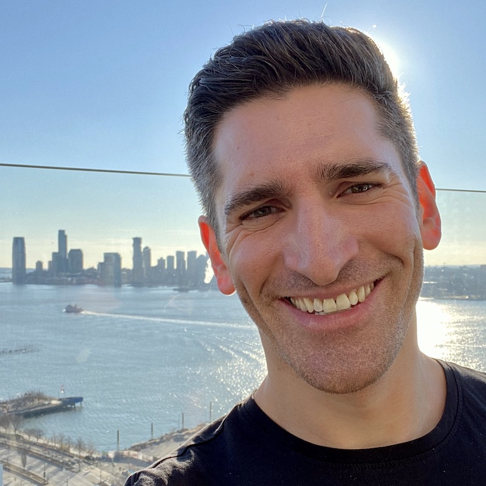

News

  
<a href="https://www.npr.org/sections/health-shots/2021/08/06/1025553638/how-a-gay-community-helped-the-cdc-spot-a-covid-outbreak-and-learn-more-about-de">NPR: COVIDoutlook Founders Give CDC Headstart on Provincetown Investigation</a>

  
<a href="https://www.rollingstone.com/culture/culture-features/covid-delta-variant-provincetowns-gay-community-1214665/">Rolling Stone: What Provincetown’s Gay Community Can Teach Us About Containing Covid</a>

  
<a href="./assets/img/COVIDoutlook%20Release%20on%20Commendations%20from%20NYS%20Governor.pdf">COVIDoutlook Founders Receive Commendation from the State of New York</a>

  
<a href="https://www.cnbc.com/video/2021/07/30/what-surprised-us-was-the-large-amount-of-symptomatic-disease-says-drexels-levasseur.html">CNBC: Prof. Michael LeVasseur Discusses COVID Breakthrough Cases</a>

*Launched in Summer 2020, COVIDoutlook.info is a volunteer-run website that provides independent data-driven analyses and forecasts about the COVID-19 crisis in the United States for policymakers and individuals. We hope our work can help people make the best decisions for themselves, their families, and their communities during this complicated time of heightened risk.* 

Interested in helping out and have web development experience? Get in touch! <a href="mailto:COVIDoutlook@gmail.com">COVIDoutlook@gmail.com</a>

{: style="float: left; width: 235px; height: 235px; padding: 25px 25px 25px 25px;"} **Michael Donnelly, MSc - Founder, Lead Modeler**
<a href="https://www.michaeldonnel.ly"><i class="fa fa-globe" aria-hidden="true"></i></a>  <a href="https://twitter.com/donnellymjd"><i class="fa fa-twitter" aria-hidden="true"></i></a><a href="https://www.linkedin.com/in/michaeljdonnelly/"><i class="fa fa-linkedin-in" aria-hidden="true"></i></a><a href="https://github.com/donnellymjd"><i class="fa fa-github" aria-hidden="true"></i></a><a href="mailto:donnellymjd@gmail.com"><i class="fa fa-envelope" aria-hidden="true"></i></a>

Michael is a data scientist with nearly a decade of experience in data analysis, data science management, and time series forecasting. Michael is a graduate of Vassar College and holds a Masters Degree from the London School of Economics. He has also managed the development and operations of research units in the public and private sectors. Michael's analysis in early March 2020 were pivotal in convincing public authorities in New York City and New York State to prepare for a massive public health crisis. His work on the novel coronavirus and COVID-19 have been reported on in [the Financial Times](https://www.ft.com/content/a52198f6-0d20-4607-b12a-05110bc48723), [WNYC's The Gothamist](https://gothamist.com/news/it-will-overwhelm-healthcare-system-cuomo-asks-federal-government-covid-19-response), [The New York Post](https://nypost.com/2020/04/01/nyc-map-shows-percentage-of-patients-with-coronavirus-by-zip-code/), and [Politico](https://www.politico.com/states/new-york/albany/story/2020/03/20/new-york-city-hospitals-prepare-for-patient-surge-1268592), among many [others](https://www.michaeldonnel.ly/media-mentions.html).

{: style="float: left; width: 235px; height: 235px; padding: 25px 25px 25px 25px;"} **Michael LeVasseur, PhD, MPH - Co-Founder, Head of Research** 
<a href="./assets/img/LeVasseur_Resume.pdf"><i class="fa fa-university" aria-hidden="true"></i></a>  <a href="https://drexel.edu/dornsife/academics/faculty/Michael-LeVasseur/"><i class="fa fa-globe" aria-hidden="true"></i></a>  <a href="https://www.linkedin.com/in/milevasseur/"><i class="fa fa-linkedin-in" aria-hidden="true"></i></a><a href="mailto:mtl55@drexel.edu"><i class="fa fa-envelope" aria-hidden="true"></i></a>

Prof. LeVasseur is an infectious disease epidemiologist and assistant professor in the Department of Epidemiology and Biostatistics at Drexel University’s Dornsife School of Public Health. Michael is also the lead epidemiologist for Drexel University’s COVID-19 testing program and runs a weekly interdisciplinary COVID-19 journal club exploring various aspects of the pandemic from the molecular through the societal. He received his Bachelor’s degree in liberal arts with concentrations in molecular biology and medical anthropology from Sarah Lawrence College, his Masters in Public Health with a concentration in epidemiology from the CUNY Hunter School of Public Health, and his PhD in Epidemiology from Drexel University’s Dornsife School of Public Health. He has worked at the Bureau of Environmental Safety and Policy at the New York City Department of Health and Mental Hygiene the HIV Behavioral Research Center at Columbia University, Weill Cornell Medical College, the Center for Health Incentives and Behavioral Economics at UPenn, and the Center for Firefighter Injury Research & Safety Trends at Drexel University. Michael’s research interests include HIV epidemiology, data science, and sexual and gender minority health disparities.